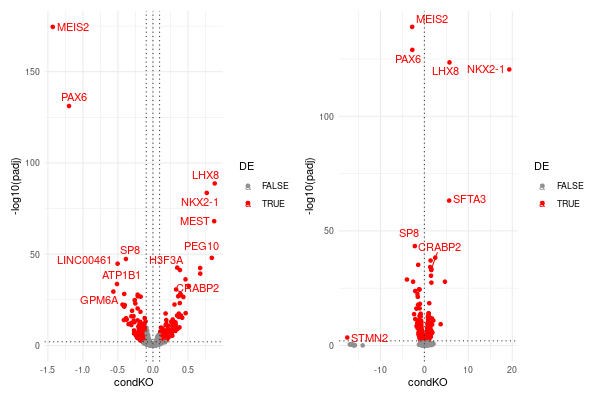

# Tutorial of condition comparison analysis of scRNA-seq data
#### Compiled by Zhisong He, Barbara Treutlein
#### Updated on 2022-04-05
### Table of Content
  * [Introduction](#introduction)
  * [Preparation](#preparation)
  * [Part 1. Descriptive analysis of the data set](#part-1-descriptive-analysis-of-the-data-set)
    * [Step 0. Import the required packages](#step-0-import-the-required-packages)
    * [Step 1. Load the data](#step-1-load-the-data)
    * [Step 2. Package of routine processing](#step-2-package-routine-processing)
    * [Step 3. Data integration](#step-3-data-integration)
    * [Step 4. Clustering and annotation](#step-4-clustering-and-annotation)
  * [Part 2. Comparison of cell type compositions between conditions](#part-2-comparison-of-cell-type-compositions-between-conditions)
    * [Step 1. Visually check the compositions](#step-1-visually-check-the-compositions)
    * [Step 2-1. Composition comparison with Fisher's exact test](#step-2-1-composition-comparison-with-fishers-exact-test)
    * [Step 2-2. Composition comparison with generalized linear model (GLM)](#step-2-2-composition-comparison-with-generalized-linear-model-glm)
    * [Step 3. Problems of those statistics and robustness of differences](#step-3-problems-of-those-statistics-and-robustness-of-differences)
    * [Another scenario: when you have mosaic samples](#another-scenario-when-you-have-mosaic-samples)
    * [Methods which don't rely on predefined cluster or cell type/state labels](#methods-which-dont-rely-on-predefined-cluster-or-cell-typestate-labels)
  * [Part 3. Differential expression analysis](#part-3-differential-expression-analysis)
    * [General transcriptome similarity](#general-transcriptome-similarity)
    * [Wilcoxon test for DE](#wilcoxon-test-for-de)
    * [DESeq2 for DE](#deseq2-for-de)
    * [Self-implemented GLM model for DE](#self-implemented-glm-model-for-de)
    * [What to do next?](#what-to-do-next)

## Introduction
You may have known what you would probably do after getting your scRNA-seq data set, including all the quality control, normalization, dimension reduction, clustering and annotation, as well as some more analysis like pseudotime analysis and RNA velocity. You may have known that batch effect is something very difficult to avoid when your data set contains multiple samples, or you need to incorporate multiple data sets into the analysis; and therefore, you may have had experiences of several data integration methods.

However, your experimental design may be more complicated. Maybe you have scRNA-seq data representing two different conditions, each with replicates, and what you want to do is not just to know what you have in the scRNA-seq data, but also what's the difference between the two conditions.

This is what this tutorial is about. We will talk about in more details how to quantitatively compare scRNA-seq data representing two different conditions. The comparison focuses on both the cell type composition differences, as well as the differential expression. If you are interested in the more basic and general scRNA-seq data analysis, please refer to the other vignette "[Tutorial of single-cell RNA-seq data analysis in R](https://github.com/quadbiolab/scRNAseq_analysis_vignette/)".

## Preparation
In this tutorial, we provide one example data set which was generated using 10x Genomics and preprocessed using Cell Ranger. This data set is a part of the scRNA-seq data presented in the preprint paper "[Inferring and perturbing cell fate regulomes in human cerebral organoids](https://www.biorxiv.org/content/10.1101/2021.08.24.457460v1)", which contains two different conditions (GLI3 knockout or KO, and wildtype or WT). The tutorial contains three parts. In the first part we will quickly go through the descriptive analysis. Those analysis should have been largely covered by the [other vignette](https://github.com/quadbiolab/scRNAseq_analysis_vignette/). In the second part, we will compare the cell type composition of the two conditions. In the third part, we will focus on looking for differentially expressed genes between the two conditions.

## Part 1. Descriptive analysis of the data set
### Step 0. Import the required packages
Similar to the other vignette, we use the ```Seurat``` package to do the analysis in R. So first of all, we need to import the ```Seurat``` package, as well as other critical packages used here.
```R
library(Seurat)
library(Matrix)
library(dplyr)
```

### Step 1. Load the data
Here we use the ```Read10X``` function to directly generate the count matrix from the example data. The metadata table (two columns: "organoid" for the organoid sample and "GLI3_status" for the conditions) will be also read in. Based on them we will create the Seurat object.
```R
counts <- Read10X("data/", gene.column=1)
meta <- read.table("data/meta.tsv.gz")
seurat <- CreateSeuratObject(counts, meta.data = meta)
```
<span style="font-size:0.8em">*P.S. The ```gene.column``` parameter has a default value of 2. That is because in the Cell Ranger output the gene symbols are at the second column while the first column is for Ensembl IDs. In the example data set, however, there is only one column in the features.tsv.gz file which is the gene symbol. Therefore, we need to set this parameter to 1.*</span>

### Step 2. Package routine processing
Now let's go fast. We can quickly go through the routine analysis and see how the data look
```R
seurat <- NormalizeData(seurat) %>%
  FindVariableFeatures(nfeatures = 3000) %>%
  CellCycleScoring(s.features = cc.genes.updated.2019$s.genes,
                   g2m.features = cc.genes.updated.2019$g2m.genes)
VariableFeatures(seurat) <- setdiff(VariableFeatures(seurat),
                                    c(unlist(cc.genes.updated.2019),
                                    grep("^MT-", rownames(seurat), value=T)))
seurat <- ScaleData(seurat, vars.to.regress = c("G2M.Score","S.Score")) %>%
  RunPCA(npcs = 20) %>%
  RunUMAP(dims = 1:20)

plot1 <- UMAPPlot(seurat, group.by="organoid") & NoAxes()
plot2 <- FeaturePlot(seurat, c("FOXG1","EMX1","DLX2","MKI67"), order=T) & NoAxes() & NoLegend()
plot1 | plot2

```
<br/><br/>
It is not bad at all, but there seems to be some cells from the KO batch and WT batch which express the same markers but separated. Since they might represent some batch effect which may confound the following comparison, we will try to do data integration. It can hopefully help to generate a universal annotation covering both conditions for the next comparisons.

### Step 3. Data integration
There are different data integration one can try, such as ```Seurat```, ```LIGER```, ```MNN```, ```Scanorama``` and ```CSS```. More examples of how to run those integration methods are included in the other [vignette](https://github.com/quadbiolab/scRNAseq_analysis_vignette/). In this tutorial, we directly apply CSS, which was used in the original paper. Again, this is just an example. Do try more integtation methods and then choose the one you like the best.

One thing to keep in mind is that we cannot simply assume that different conditions still share the same cell types. Therefore, please be critical when checking the integration result and try to avoid using any integration result which may over-integrate the data.
```R
library(simspec)

seurat <- cluster_sim_spectrum(seurat, label_tag = "organoid", cluster_resolution = 1)
seurat <- RunUMAP(seurat, reduction = "css", dims = 1:ncol(Embeddings(seurat,"css")), reduction.name = "umap_css", reduction.key = "UMAPCSS_")
plot1 <- DimPlot(seurat, reduction = "umap_css", group.by="GLI3_status") & NoAxes()
plot1 <- DimPlot(seurat, reduction = "umap_css", group.by="organoid") & NoAxes()
plot2 <- FeaturePlot(seurat, c("FOXG1","EMX1","DLX2","MKI67"), reduction = "umap_css", order=T) & NoAxes() & NoLegend()
plot1 | plot2
```
<br/><br/>

### Step 4. Clustering and annotation
Based on the integrated data, we next apply clustering to the cells.
```R
seurat <- FindNeighbors(seurat, reduction = "css", dims = 1:ncol(Embeddings(seurat,"css"))) %>%
  FindClusters(resolution = 0.9)

plot1 <- DimPlot(seurat, reduction = "umap_css", label=T) & NoAxes() & NoLegend()
plot2 <- FeaturePlot(seurat,
                     c("SOX2","DCX","FOXG1","EMX1","DLX2","MKI67","OTX2","HOXB2","TTR"),
		     reduction = "umap_css", order=T) & NoAxes() & NoLegend()
plot1 | plot2
```
<br/><br/>

Based on the marker expression, we can assign the regional labels to each cluster.
```R
seurat$region <- factor(setNames(c("ventral telen.",
                                   "ventral telen.",
                                   "non-telen.",
                                   "dorsal telen.",
                                   "non-telen.",
                                   "non-telen.",
                                   "non-telen.",
                                   "ventral telen.",
                                   "non-telen.",
                                   "dorsal telen.",
                                   "non-telen.",
                                   "ventral telen.",
                                   "non-telen.",
                                   "non-telen.",
                                   "non-telen.",
                                   "mixed",
                                   "dorsal telen.",
                                   "non-telen.",
                                   "dorsal telen."),
                                 levels(seurat@active.ident))[seurat@active.ident],
                        levels=c("dorsal telen.","ventral telen.","non-telen.","mixed"))
plot1 <- DimPlot(seurat, reduction = "umap_css", group.by = "region") & NoAxes()
plot2 <- FeaturePlot(seurat, c("SOX2","DCX","FOXG1","EMX1","DLX2","MKI67","OTX2","HOXB2","TTR"),
                     reduction = "umap_css", order=T) & NoAxes() & NoLegend()
plot1 | plot2
```
<br/><br/>
<span style="font-size:0.8em">*P.S. The annotation here is very rough with only the regional identities, but without either the NPC-neuron classification or the further separation of different non-telencephalic regions (e.g. diencephalon, mesencephalon, rhombencephalon). This is more for simplicity. Also in this particular example, it makes sense biologically as GLI3 is thought to be critical for regional identity establishment. When analyzing your own data though, you need to think about on which level to compare different conditions, and try to annotate the cells in a proper way.*</span>

## Part 2. Comparison of cell type compositions between conditions
The first possible difference between two conditons is the composition of cell types or cell states. That being said, one of the two different conditions may promote or prevent the formation/transformation/death of certain cell types or cell states, and therefore, in the scRNA-seq data of the two conditions, the cell clusters representing those cell types/states would show different proportion of cells in the two conditions. In this part of the analysis we will talk about how to screen for such differences.

### Step 1. Visually check the compositions
The easiest and also the most straightforward way to check whether compositions are different among samples, and more importantly, between conditions, is to look at it visually. Doing a bar plot is probably the easiest way. So what we need to do is to firstly count the number of cells in each cell type/state identity (here the regional label) for each sample. These numbers can be also normalized into proportions of cell in each cell type/state for each sample. Last, we can plot those numbers as a stacked bar plot, for instance.
```R
freq <- table(seurat$region, seurat$organoid)
prop <- apply(freq,2,function(x) x/sum(x))

layout(matrix(1:3,nrow=1)); par(mar=c(8,5,1,1))
barplot(freq, col=c("#E74C3C","#A569BD","#76D7C4","#CCD1D1"),
        border=NA, las=2, ylab="Frequency", cex.names = 0.8)
barplot(prop, col=c("#E74C3C","#A569BD","#76D7C4","#CCD1D1"),
        border=NA, las=2, ylab="Proportion", cex.names = 0.8)
plot.new()
legend("left", fill=c("#E74C3C","#A569BD","#76D7C4","#CCD1D1"), legend=rownames(freq), bty="n")
```
<br/><br/>

One obvious difference between the two conditions is that the two WT samples contain reasonable proportion of dorsal telencephalic cells, while both the KO samples have very few of them. The next question we want to ask then, is how to quantitatively and unbiasedly identify the significant difference on these proportions with certain statistics.

### Step 2-1. Composition comparison with Fisher's exact test
[Fisher's exact test](https://en.wikipedia.org/wiki/Fisher%27s_exact_test) is a statistical significance test which is useful for categorical data that result from classifying objects in two different ways; it is used to examine the significance of the association between the two kinds of classification. From this information you would probably feel its potential application in quantifying composition differences. We can consider the following two ways of "classifying objects" (here objects being cells). One is to group cells based on which condition they belong to; the other is to group cells based on whether they belong to one cell type/state/identity or not. In this way, every cell type/state results in a 2x2 contingency table, which is used as the input of Fisher's exact test. The same procedure can be applied to each cell type/state/identity, each resulting in two values: 1) the odds ratio which shows the degree of enrichment (>1) or depletion (<1); 2) the p-value which shows the statistical significance. Since the test is applied to each identity, a multiple test correction procedure should be applied to the p-values for the final statistical significance.

Now let's apply this method to the example data.
```R
freq_fisher <- function(conditions, have_identity){
  freq <- table(factor(have_identity, levels=c(TRUE,FALSE)),
                conditions)
  test <- fisher.test(freq)
  res <- setNames(c(test$estimate, test$p.value), c("oddsratio","pval_fisher"))
  return(res)
}

region_enrichment <- data.frame(region = levels(seurat$region),
  # loop and test every region
  t(sapply(levels(seurat$region), function(region)
    freq_fisher(conditions = factor(seurat$GLI3_status, levels=c("KO","WT")),
                have_identity = seurat$region == region)
  )),
  row.names=NULL)
region_enrichment$padj_fisher <- p.adjust(region_enrichment$pval_fisher)
```
The essential part of the script is to generate the ```freq``` matrix, whose rows represent cells of the to-be-tested region (TRUE, first row) or not (FALSE, second row), and whose columns represent cells of conditions being KO (first column) or WT (second column).

The output data frame ```region_enrichment``` shows the statistical significance, as well as whether it is an enrichment or depletion in the KO condition in relative to WT.

<br/><br/>

### Step 2-2. Composition comparison with generalized linear model (GLM)
You may have noticed, that although there are two samples per condition, Fisher's exact test does not take into account such replicate information, although as we all know, having replicates and making sure that observations are replicable in multiple replicates are critical for discovery. Is it possible then, to have another statistical test which can take into account the replicate information? A [generalized linear model](https://en.wikipedia.org/wiki/Generalized_linear_model) (GLM) may help here.

You are probably familiar with an ordinary linear model. A generalized linear model is its flexible generalization. The GLM allows the linear model to be related to the response variable via a link function, and allows the magnitude of the variance of each measurement to be a function of its predicted value (therefore, supports non-Gaussian distribution).

Thinking about the cell sampling process of a scRNA-seq experiment, assuming the sampled cells are only a small proportion of the whole population, getting one cell from a certain cell population is like a [Bernoulli trial](https://en.wikipedia.org/wiki/Bernoulli_trial). Therefore, we can assume that the proportion of sampled cells of that population among all follows binomial distribution. In that case, we can try to use a GLM with binomial distribution followed by ANOVA to obtain how such proportion is related to the condition labels of different samples or replicates. In terms of the effect size, although odds ratio is no longer calculated, the GLM model can estimates a coefficient of the KO condition in relative to WT. Because of logit function used to link the linear model with the probability, a positive coefficient means enrichment, while a negative coefficient means depletion.

```R
freq_glm_aov <- function(samples, conditions, have_identity){
  sample_conditions <- unique(data.frame(sample = samples, condition = conditions))
  sample_conditions <- setNames(sample_conditions$condition, sample_conditions$sample)

  freq <- table(samples, factor(have_identity, levels=c(TRUE,FALSE)))
  m <- glm(freq ~ sample_conditions[rownames(freq)], family = "binomial")
  aov <- anova(m, test = "Chisq")
  res <- setNames(c(coef(m)[2], aov$Pr[2]), c("coef_glm","pval_aov"))
  return(res)
}

region_enrichment <- data.frame(region_enrichment,
  # loop and test every region
  t(sapply(levels(seurat$region), function(region){
    freq_glm_aov(samples = seurat$organoid,
                 conditions = factor(seurat$GLI3_status, levels=c("WT","KO")),
                 seurat$region == region)
  })),
  row.names=NULL)
region_enrichment$padj_aov <- p.adjust(region_enrichment$pval_aov)
```

The result actually looks quite similar to the Fisher's exact test.

<br/><br/>

### Step 3. Problems of those statistics and robustness of differences
You may have already felt a bit puzzled, as the results don't seem to make fully sense. According to both tests, proportions of all the three regions are changed significantly in KO in relative to WT. This is very convincing for dorsal and ventral telencephalon, but not really convicing for non-telencephalon.

And we feel the same. What makes it convincing or not is the robustness of the differences. This can be easily visualize by bar plots, which instead of the stacked bar plot showing all the regions of each sample together, show the proportion of each region in each sample separately.
```R
org_status <- unique(data.frame(organoid=seurat$organoid,
                                GLI3_status=factor(seurat$GLI3_status, levels=c("WT","KO"))))
org_status <- setNames(org_status$GLI3_status, org_status$organoid)

layout(matrix(1:4,nrow=1))
for(region in c("dorsal telen.","ventral telen.","non-telen.")){
  props <- setNames(sapply(sort(unique(seurat$organoid)), function(organoid)
                      mean(seurat$region[seurat$organoid == organoid] == region)),
                   sort(unique(seurat$organoid)))
  barplot(props[order(props)],
          col = ifelse(org_status[names(props)[order(props)]] == "WT", "#cdcdcd", "#303030"),
          ylab = "Proportions", main = region, las = 2, cex.names = 0.8)
}
plot.new()
legend("left", fill = c("#cdcdcd","#303030"), legend = c("WT","KO"), bty="n")
```
<br/><br/>

It is very clear that for dorsal and ventral telencephalon, the increased/decreased proportions are stable in both replicates; while for non-telencephalon, such "significant" change is mostly due to just one KO sample with relatively high proportion.

This robustness issue reflects a common problem when applying typical significance tests to scRNA-seq data. Most of the significance test people commonly use in statistics have null hypothesis that certain features of different conditions being **IDENTICAL**. In real world, however, it is actually hard to get two sampled populations being truely identical. In real biology, there are no two biological replicates, sometimes even technical replicates, would be exactly the same. There are no two identical human, and of course also no two identical organoids. Therefore, when there is sufficient statistical power, we can always identify "differences" while many of them might be minor or meaningless. Meanwhile, in single-cell genomics, statistical power is probably the cheapest thing as we always have thousands of objects (cells) per group.

So is there any possibility to deal with this problem? Yes, there are several strategies one may consider.

#### Solution 1. Check visually or have stringent requirement
When the numbers of replicates are small, just like the example data set, checking the cell type proportion per sample and requiring consistent enrichment/depletion would be a reasonable way. For instance, on top of the p-values output by the tests, we can require the proportions in all samples of one condition are always higher/lower than all samples of the other condition.

#### Solution 2. Leave-one-sample-out and its variants
Alternatively, we can repeat the test but each time dropping one sample to make sure that the detected difference is not due to one outlier sample. Let's see how it looks when applying this strategy to the Fisher's exact test.
```R
region_enrichment_drop1 <- data.frame(
  # loop and test every region
  do.call(rbind, lapply(levels(seurat$region), function(region){
    data.frame(region = region,
               dropped = sort(unique(seurat$organoid)),

               # loop and excl one sample each
               t(sapply(sort(unique(seurat$organoid)), function(org){
                 idx_cells <- which(seurat$organoid != org)
                 freq_fisher(conditions = factor(seurat$GLI3_status, levels=c("KO","WT")),
                             have_identity = seurat$region == region)
               }))
    )
  })),
  row.names=NULL)
region_enrichment_drop1$padj_fisher <- p.adjust(region_enrichment_drop1$pval_fisher)
```
<br/><br/>
So for the non-telencephalon region, the significance of the difference is mostly from one KO sample "GLI3_KO_I2_45d", which suggests that the previously detected difference may not be robust enough to be reported.

<span style="font-size:0.8em">*P.S. This procedure can also be slightly modified, e.g. by excluding one sample per condition.*</span>

#### Solution 3. Permutations
Another possible strategy is label shuffling or permutation. We can shuffle the sample condition labels for all possible combinations; or when there are many samples (pretty unlikely though for scRNA-seq data sets) and therefore too many combinations, we can also randomly choose certain number of them (e.g. 100 times). Repeat the tests after doing each shuffling. After doing all the shufflings and tests, check the distribution of both the statistical estimates (e.g. odds ratio in Fisher's exact test) and the p-values. If the tests with the original labels give much more significant than most of the others, in terms of smaller p-value and larger magnitude of the estimates, the original test result is likely robust to samples and reliable.

Here we provide the script to generate a sample-condition permutation matrix.
```R
label_permut <- function(samples, conditions, num_permut = 100){
  sample_conditions <- unique(data.frame(sample = samples, condition = conditions))
  sample_conditions <- setNames(sample_conditions$condition, sample_conditions$sample)
  
  num_samples_per_conditions <- table(sample_conditions)
  max_num_permut <- Reduce("*", sapply(2:length(num_samples_per_conditions), function(i)
                                  choose(n = sum(num_samples_per_conditions[(i-1):length(num_samples_per_conditions)]),
                                         k = num_samples_per_conditions[i])
                                ))
  
  num_permut <- min(c(num_permut, max_num_permut))
  
  # generate permutations of sample-condition pairs
  if (num_permut / max_num_permut < 0.2){ # random label shuffling
    permut_sample_conditions <- lapply(1:num_permut, function(i)
      setNames(sample(sample_conditions),names(sample_conditions)))

  } else{ # exact label permutations
    permuts <- utils::combn(1:length(sample_conditions), num_samples_per_conditions[1])
    for(i in 2:length(num_samples_per_conditions)){
      permuts <- do.call(cbind, lapply(1:ncol(permuts), function(j){
        permuts_istep <- utils::combn(setdiff(1:length(sample_conditions), permuts[,j]),
                                      num_samples_per_conditions[i])
        permuts_after <- apply(permuts_istep, 2, function(x) c(permuts[,j], x))
      }))
    }
    
    conds <- rep(sort(unique(sample_conditions)), num_samples_per_conditions)
    permut_sample_conditions <- lapply(sample(ncol(permuts))[1:num_permut], function(i)
      setNames(conds, names(sample_conditions)[permuts[,i]])[names(sample_conditions)]
    )
  }

  return(setNames(data.frame(as.data.frame(permut_sample_conditions),
                             row.names=names(sample_conditions)), NULL))
}

```

<span style="font-size:0.8em">*P.S. You may feel the function a bit unnecessarily complicated. Indeed, in most of the time when doing permutations for many genomic studies, we only use the random shuffling methods. That is because in most of the time we have so many samples that the number of non-redundant shuffled label combinations is much larger than the number of permutations we actually need. Therefore, we can assume that there is no two random shufflings resulted in exactly the same combinations. However, when the sample numbers are not big, and/or the sample numbers of different conditions are super imbalanced, the possible shuffled label combinations would be limited. In that case, it would be much better to do the exact permutations, i.e. getting all the possible combinations first, and only afterwards to select the desired number of shuffling from those unrepeated ones.*</span>


Applying the script to the example data set resulted in a data frame, whose row names are sample names and every column shows one shuffled condition labels.
```R
permut_sample_conditions <- label_permut(seurat$organoid,
                                         factor(seurat$GLI3_status, levels=c("WT","KO")))
```
<br/><br/>

Next, we can in princple use each of shuffled condition labels of samples to regenerate a new cell-condition vector, as the input to the previously defined ```freq_fisher``` or ```freq_glm_aov``` function. However, in the particular scenario of the example data set, this won't be a very good idea, as there are only six combinations available, including the original one and the one with completely opposite pairs (i.e. all KO->WT and all WT->KO). The remaining four combinations won't tell us much, for sure no more than just looking at the bar plots. However, whenever you have a data set with more samples per condition, this would be a strategy you can keep in mind.

#### Others
There are of course also other possible statistical solutions. For instance, there is a statistical test called ```rMATS``` (the PNAS paper is [here](https://www.pnas.org/doi/10.1073/pnas.1419161111)) which was originally developed to identify alternative splicing events that show difference between two conditions. Instead of assuming samples from the same condition having the same inclusion ratio (the proportion of spliced-in reads in relative to all), it assumes a normal distribution per condition and then uses a likelihood ratio test to identify alternative splicing events with large enough inclusion ratio difference between the two conditions. As every alternative splicing event is modeled as a Bernoulli trial just as the way we do above for the composition comparison between conditions, this method is principally applicable to our analysis. There are also other methods which could be also useful here. Be creative.

### Another scenario: when you have mosaic samples
Nowadays there is another type of experiment that can generate scRNA-seq data representing multiple conditons, that is, scRNA-seq on mosaic samples. One typical example is the CRISPR-based mosaic perturbation experiments, by introducing varied guide RNAs (gRNAs), which target different genes, into different cells of the same sample whose cells have Cas9 protein expression. This allows different cells in one sample to generate different types of gene knockouts, which on one hand allows large-scale gene perturbation screening happened in a more affordable manner, on the other hand reduces the possible technical variations as all cells of different conditions will then have similar genetic background, share the same environment, and being applied to the same experiments. [CROP-seq](https://www.nature.com/articles/nmeth.4177) and [Perturb-seq](https://www.sciencedirect.com/science/article/pii/S0092867416316105) are two examples of this type of experiments. There are also other experiments which can generate this type of data. For instance, we can mix stem cells with different genetic conditions (e.g. KO and WT) and then grow organoids from the mosaic stem cell pool, which gives us mosaic organoids. Afterwards we can either FACS sort cells of the two different conditions in they have corresponding fluorescent proteins, or read out their identity if they have identity barcodes.

In that case, we can of course also compare the cell type/state compositions of different conditions. Fisher's exact test, as mentioned above, will be still applicable to such scenario. However, the drawback of Fisher's exact test, that the replicate/sample information is not taken into account, is still a big problem. The GLM model described above will no longer work as we don't have one condition label for each sample. We would then want to have some other statistical methods.

#### Option 1. Cochran–Mantel–Haenszel (CMH) test
CMH test is like an extension of the Fisher's exact test. What makes it different is that it allows stratification or matching of the data, checking associations at each stratum and then taking into account all the strata to get the final statistics. In R, this is implemented as the function ```mantelhaen.test```. The following is the example script. Let's assume we have a Seurat object ```seurat``` which contains three metadata columns: "sample" for experimental samples, "genotype" for genetic conditions (KO/WT), and "celltype" for the cell type identity. Now we test whether the cell type "ct1" is enriched or depleted in the different genotypes.
```R
ct_enrich_cmh <- mantelhaen.test(x = factor(seurat$genotype, levels=c("WT","KO")),
                                 y = seurat$ct == ct1, levels=c(TRUE,FALSE),
                                 z = seurat$sample)
ct_enrich_cmh <- setNames(c(ct_enrich_cmh$estimate, ct_enrich_cmh$p.value), c("oddsratio","pval"))
```

This is a pretty recommended method, for its speed and ease to use. It's been used in several CROP-seq experiments in our group covering different organoid systems, such as [cerebral organoids](https://www.biorxiv.org/content/10.1101/2021.08.24.457460v1), [retinal organoids](https://www.biorxiv.org/content/10.1101/2022.03.16.484396v1) and [blood vessel organoids](https://www.biorxiv.org/content/10.1101/2022.03.23.485329v1).

#### Option 2. Another GLM model
Although the GLM model mentioned above no longer works, we can implement a different GLM model that takes cells instead of samples as the object to train the model, followed by ANOVA for significance estimate.
```R
freq_glm_aov_2 <- function(conditions, have_identity, samples){
  m1 <- glm(have_identity ~ conditions + samples, family = binomial)
  m0 <- glm(have_identity ~ samples, family = binomial)
  aov <- anova(m1, m0, test = "Chisq")

  res <- setNames(c(coef(m1)["conditions"], aov$Pr[2]), c("coef","pval"))
  return(res)
}

ct_enrich_glm <- freq_glm_aov_2(conditions = factor(seurat$genotype, levels=c("WT","KO")),
                                have_identity = seurat$ct == ct1,
                                samples = seurat$sample)
```
Here the ```anova``` function is used to compare two models: the full model considering both the genetic condition and sample information, while the reduced model only considering the sample information. If the genetic condition information largely improve the model performance, it suggests significant difference on the cell type proportion of the tested cell type between the two conditions.

This method is much slower than the CMH test. It has advantages of course, that it is easy to extend, by replacing the sample vector by a covariate matrix that contains multiple covariates. In that case, one can not only control for the sample information, but also other possible confounding factors at the same time.

### Methods which don't rely on predefined cluster or cell type/state labels
Doing composition comparison on cluster level or cell type/state level is straightforward. However, sometimes clustering is pretty arbitrary as it highly depends on parameters (e.g. resolution). For systems dominated by cell state continuum rather than very distinct cell types, the clustering-based composition comparison may encounter even bigger challenge. In that case, methods which don't require any pre-defined clusters could be very good alternatives.

One good example is [Milo](https://github.com/MarioniLab/miloR), developed by John Marioni lab in EMBL-EBI. It is based on the kNN graph of the cells, to firstly define cell neighborhoods which can be overlapped with each other. Afterwards, a negative binomial GLM framework is used to test difference of cell abundance in each neighborhood between different conditions. For more details of the method principle, please refer to their [manuscript](https://www.nature.com/articles/s41587-021-01033-z). One "drawback" for Seurat users, though, is that Milo relies on the ```SingleCellExperiment``` object in Bioconductor, which is a different data type from Seurat. You may therefore need more time to get into it.

Another example is the differential abundance test on each cell neighborhood, which was used in the manuscript "[Fate and state transitions during human blood vessel organoid development](https://www.biorxiv.org/content/10.1101/2022.03.23.485329v1)". The idea of this method is very similar to the cluster-based composition comparison described above; but instead of doing the test on each cluster, it applies the test to the k-nearest neighborhood of every single cell. Diffusion-based data smoothing is then used to refine the estimate of each cell neighborhood.

While the clustering-free methods may sound great, they are not necessarily better than the cluster-based method, especially when the biological intepretation of the clusters, as well as the biological question to answer, are clear. They can be therefore complemetary with each other.

<span style="font-size:0.8em">*P.S. The current version of the tutorial doesn't include specific example script for those methods. They could be included in the next update.*</span>

## Part 3. Differential expression analysis
Besides the cell type/state composition or abundance difference, another important difference that could happen between different conditions is differential expression (DE). And of course, here the DE should be after dissecting out the cell type heterogeneity, and therefore, DE on the same cell type/state but between different conditions.

Since the early years of scRNA-seq technology being developed, there have been dozens of DE methods specifically developed for scRNA-seq data. Examples include [SCDE](http://hms-dbmi.github.io/scde/index.html) by the Kharchenko Lab at Harvard University. Also, there are commonly used DE methods developed originally for bulk RNA-seq data analysis, which are shown to perform as good in scRNA-seq data, such as DESeq2, edgeR and limma. And, don't forget the old school statistical tests like Wilcoxon test and t-test! They also work well in many scenarios (we use Wilcoxon test for marker identification in the other tutorial, for example).

So how to choose the method. There have been quite some papers (e.g. [Soneson & Robinson, 2018](https://www.nature.com/articles/nmeth.4612) and the "Differential expression testing" section of [Luecken & Theis, 2019](https://www.embopress.org/doi/full/10.15252/msb.20188746))  talking about DE analysis on scRNA-seq, summarizing and comparing different statistical tests to identify differentially expressed genes (DEGs). We usually believe that, while different DE methods for sure return different results, the general trend should be quite consistent, with the strongest signal always preserved. Therefore, to use which DE method is more like a personal choice. You can choose the method as suggested by those benchmark papers, or just use the method you've used to use. One hint is that those studies suggest that those methods developed for bulk RNA-seq are much faster than their scRNA-seq-specific counterpart, but show comparable performance.

### General transcriptome similarity
But, before going to the DE analysis, there is more we can do. For instance, we can compare the general transcriptome similarities of the same cell type/state in different samples or conditions. We can get a general feeling whether there exists any substantial transcriptomic changes in this cell type/state between conditions, and therefore worths the effort to go further to the DE analysis.

Focusing on the Cluster-0 in the example data set, which should be the ventral telencephalic neurons based on the marker expression, we define the transcriptomic similarity between two samples as the Pearson's correlation coefficient between the average gene expression levels of cells in the two samples along the highly variable genes.
```R
seurat_ventral <- subset(seurat, subset = seurat_clusters == 0) %>%
  FindVariableFeatures()

avg_expr_org <- sapply(sort(unique(seurat$organoid)), function(org)
  rowMeans(seurat_ventral@assays$RNA@data[,which(seurat_ventral$organoid == org)]))
corr_org <- cor(avg_expr_org[VariableFeatures(seurat_ventral),])
plot(hclust(as.dist(1-corr_org)))
```
<br/><br/>

Clearly the two KO samples are clustered together, so are the two WT samples. So although all those cells are in the same cluster, there are likely substantial changes on gene expression between those from WT and those from KO. We should therefore look deeper into actually looking for genes with expression differences or DE between the two conditions in this cluster.

### Wilcoxon test for DE
When doing cell type marker identification, which is also a DE analysis essentially, we usually use Wilcoxon's rank sum test, just as shown in [the other scRNA-seq data analysis tutorial](https://github.com/quadbiolab/scRNAseq_analysis_vignette). So why not also use the same test here?

Here let's also focus on the Cluster-0 ventral telencephalic neurons in the example data set. We can apply the Wilcoxon test implemented in the ```presto``` package to compare cells in that cluster from the KO samples and those from the WT samples.
```R
DE_wilcoxauc_ventral <- wilcoxauc(seurat_ventral, group_by = "GLI3_status") %>%
  filter(group == "KO") %>%
  mutate(DE = abs(logFC)>log(1.1) & padj < 0.01) %>%
  mutate(DEG = ifelse(abs(logFC)>log(1.1) & padj < 0.01, feature, NA))
```
Next we can visualize the result via a volcano plot
```R
library(ggplot2)
library(ggrepel)
ggplot(DE_wilcoxauc_ventral, aes(x = logFC, y = -log10(padj), col=DE, label=DEG)) +
  geom_point() +
  geom_text_repel() +
  geom_vline(xintercept=c(-log(1.1), log(1.1), 0), col="#303030", linetype="dotted") +
  geom_hline(yintercept=-log10(0.01), col="#303030", linetype="dotted") +
  scale_color_manual(values=c("#909090", "red")) +
  theme_minimal()
```
<br/><br/>

### DESeq2 for DE
DESeq2 is one of the most commonly used method for DE analysis in bulk RNA-seq. As mentioned above, those bulk RNA-seq DE methods, including DESeq2, have been proven to be well performed in scRNA-seq data as well. We can therefore directly use the scRNA-seq data as the input to the DESeq2 pipeline to get the DE results. Similarly, we can then use a volcano plot to show the result.
```R
library(DESeq2)
library(scran)

det_rate <- rowMeans(seurat_ventral@assays$RNA@data)
meta <- seurat_ventral@meta.data %>% mutate(GLI3_status = factor(GLI3_status, levels=c("WT","KO")))
dds <- DESeqDataSetFromMatrix(seurat_ventral@assays$RNA@counts[det_rate > 0.05,],
                              colData=meta,
                              design = ~ GLI3_status)
sizeFactors(dds) <- calculateSumFactors(seurat_ventral@assays$RNA@counts[det_rate > 0.05,])
dds <- DESeq(dds, test="LRT", reduced=~1, useT=TRUE, minmu=1e-6, minReplicatesForReplace=Inf)
DE_deseq2_ventral <- results(dds) %>% as.data.frame() %>%
  tibble::rownames_to_column("gene") %>%
  mutate(DE = abs(log2FoldChange)>log2(1.1) & padj < 0.01) %>%
  mutate(DEG = ifelse(abs(log2FoldChange)>log2(1.1) & padj < 0.01, gene, NA))

ggplot(DE_deseq2_ventral, aes(x = log2FoldChange, y = -log10(padj), col=DE, label=DEG)) +
  geom_point() +
  geom_text_repel(max.overlaps = 20) +
  geom_vline(xintercept=c(-log2(1.1), log2(1.1), 0), col="#303030", linetype="dotted") +
  geom_hline(yintercept=-log10(0.01), col="#303030", linetype="dotted") +
  scale_color_manual(values=c("#909090", "red")) +
  theme_minimal()
```
<span style="font-size:0.8em">*P.S. As DESeq2 was originally developed for bulk RNA-seq, which has quite some different behaviors from scRNA-seq. Therefore, some default DESeq2 setup doesn't fit scRNA-seq data. This includes the default size factor calculation, as well as some parameters in the ```DESeq``` function. What are used above are the recommended setting by [DESeq2 for scRNA-seq data analysis](http://bioconductor.org/packages/devel/bioc/vignettes/DESeq2/inst/doc/DESeq2.html#recommendations-for-single-cell-analysis).*</span>

<span style="font-size:0.8em">*P.S.2 DESeq2 supports using the ```glmGamPoi``` package to get "faster dispersion and parameter estimation routines for single-cell data". To do that, you need to have the ```glmGamPoi``` package installed via Bioconductor (```BiocManager::install("glmGamPoi")```), and then set the ```fitType = "glmGamPoi"``` parameter in the ```DESeq``` function.*</span>

<br/><br/>

The top hits look very similar to the Wilcoxon test results. The speed of running DESeq2 is much slower than the Wilcoxon test implemented in ```presto```, however, it is a much more flexible framework and has the potential to introduce additiona covariates (e.g. detected transcript number, and sample/replicate for the mosaic sample scenario) to be controlled.

### Self-implemented GLM model for DE
We can also implement the simple but flexible GLM model to do DE, which also allows extra covariates to be controlled during the DE analysis.
```R
# to do DE test for one gene
aov_DE <- function(expr, cond, covar = NULL, family = "gaussian", test = NULL){
  if (is.null(covar)) covar <- data.frame(X_const = 1)
  dat <- data.frame(y = expr,
                    cond = cond,
		    covar)
  m <- glm(y ~ ., family = family, data = dat)
  m0 <- glm(y ~ . - cond, family = family, data = dat)

  if (is.null(test)){
    test <- "F"
    if (ifelse(is(family, "family"), family$family, family) %in% c("binomial","poisson"))
      test <- "Chisq"
  }
  aov <- anova(m, m0, test = test)

  res <- c(coef(m)[grep("^cond",names(coef(m)))], aov$Pr[2])
  names(res)[length(res)] <- "pval"
  return(res)
}
```
Here when using the typical log-normalized data as the input, it assumes a normal distribution. Such an assumption is of course less correct than the model used by DESeq2, but shouldn't make the result too far away from fact. Also, one can binarize the expression vector so that it rather represents whether the gene is detected or not in a cell, and then set ```family = "binomial"``` and include the number of detected transcripts/genes in the ```covar``` data frame. This would change the test from differential expression to differential detection/ This method has been used in papers including [Kanton et al. 2019](https://www.nature.com/articles/s41586-019-1654-9). It is also effective and can nicely due with technical artifact due to coverage differences among samples.

Now let's apply the method to the ventral neurons in the example data set. Here we do both the normal DE analysis and the differential detection analysis
```R
library(pbapply)

DE_aov <- data.frame(t(pbsapply(which(det_rate > 0.05), function(i)
  aov_DE(expr = seurat_ventral@assays$RNA@data[i,],
         cond = factor(seurat_ventral$GLI3_status, levels=c("WT","KO")),
         covar = data.frame(cov = log10(seurat_ventral$nCount_RNA))))), row.names=NULL)
DE_aov$padj <- p.adjust(DE_aov$pval, method="BH")
DE_aov <- data.frame(gene = names(which(det_rate > 0.05)), DE_aov) %>%
  mutate(DE = abs(condKO)>log(1.1) & padj < 0.01) %>%
  mutate(DEG = ifelse(abs(condKO)>log(1.1) & padj < 0.01, gene, NA))

DE_aov_bin <- data.frame(t(pbsapply(which(det_rate > 0.05), function(i)
  aov_DE(expr = seurat_ventral@assays$RNA@data[i,] > 0,
         cond = factor(seurat_ventral$GLI3_status, levels=c("WT","KO")),
         covar = data.frame(cov = seurat_ventral$nCount_RNA),
         family = "binomial"))), row.names=NULL)
DE_aov_bin$padj <- p.adjust(DE_aov_bin$pval, method="BH")
DE_aov_bin <- data.frame(gene = names(which(det_rate > 0.05)), DE_aov_bin) %>%
  mutate(DE = padj < 0.01) %>%
  mutate(DEG = ifelse(padj < 0.01, gene, NA))
```
<span style="font-size:0.8em">*P.S. In the first model, the estimated coefficient of the KO category can be seen as the logFC in relative to WT. In the second model, however, because of the logit link function, it is not very straightforward to describe its physical meaning. Still, a larger magnitude should mean a larger change, and a positive coefficient means increased detection rate in KO, while a negative one means decreased.*</span>

<span style="font-size:0.8em">*P.S.2 Using the ```pbsapply``` function in the ```pbapply``` package, instead of the basic ```sapply``` function, allows a progress bar being provided.*</span>

Next we plot volcano plots for both analysis.
```R
p1 <- ggplot(DE_aov, aes(x = condKO, y = -log10(padj), col=DE, label=DEG)) +
  geom_point() +
  geom_text_repel(max.overlaps = 20) +
  geom_vline(xintercept=c(-log(1.1), log(1.1), 0), col="#303030", linetype="dotted") +
  geom_hline(yintercept=-log10(0.01), col="#303030", linetype="dotted") +
  scale_color_manual(values=c("#909090", "red")) +
  theme_minimal()
p2 <- ggplot(DE_aov_bin, aes(x = condKO, y = -log10(padj), col=DE, label=DEG)) +
  geom_point() +
  geom_text_repel(max.overlaps = 20) +
  geom_vline(xintercept=0, col="#303030", linetype="dotted") +
  geom_hline(yintercept=-log10(0.01), col="#303030", linetype="dotted") +
  scale_color_manual(values=c("#909090", "red")) +
  theme_minimal()

p1 | p2
```
<br/><br/>
The top hits also show very much consistency with the other DE methods.

### What to do next?
Once you get a list of DEGs, you can do whatever following analysis you can think of in any DE analysis. Functional enrichment analysis, for instance, is one of them. There are different tools for different gene function annotation databases. One of the most commonly used one is [DAVID](https://david.ncifcrf.gov/) for enrichment analysis of different databases including Gene Ontology, KEGG pathways and so on. Another famous enrichment analysis is [GSEA](https://www.gsea-msigdb.org/gsea/index.jsp) which considers the rank of genes annotated with certain functional category. In this case, the p-values obtained from the tests, for instance, can be used to do the ranking.

And the previous examples are only for the DE analysis on one cluster, the Cluster-0 ventral telencephalic neurons. In principle, we can apply the same analysis to all the clusters, or those clusters of your particular interest. It is also worth noting that for those tests which can take into account additional covariates to be controlled (e.g. DESeq2 and the GLM model), you may also do a global DE analysis by providing all the cells as the input meanwhile giving the cluster information as one covariate to control. In this case, you can generate one single DEG list while gaining statistical power as more cells being used; although with the drawback of lossing the capacity to know which DEGs may have the strongest effect in which cell types/states directly. But of course, you can then do analysis such as clustering the global DEGs based on their average expression in different clusters of different conditions to get such information in a different way. One just need to be creative, and in the end, you will for sure find the best to present the results that can be linked to the conclusions.
